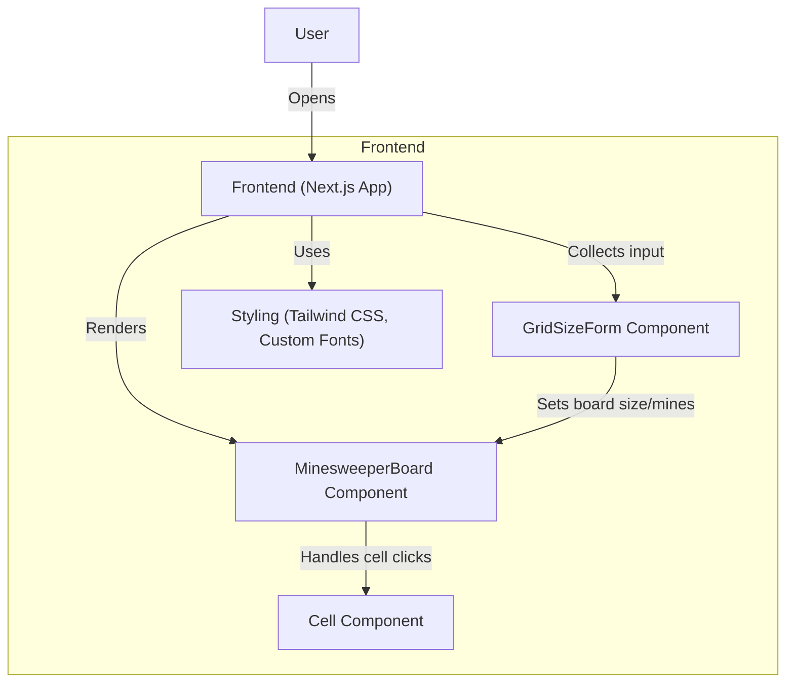

# Minesweeper System Architecture (Next.js + Flask + Python Logic)

> **Course:** EECS 581, Fall 2025  
> **Project:** Minesweeper System Development (10×10, 10–20 mines)  
> **Team:** Ansuman (Lead), Achinth (BE1), Vamsi (BE2), Taha (BE3), Jahnvi (PM)  
> **Stack:** **Frontend** – Next.js · **Backend** – Flask · **Game Logic** – Python module

---

## 1. Executive Overview

This architecture isolates **rendering**, **transport**, and **game rules** to keep the codebase easy to extend in Project 2 (e.g., difficulty levels, timers, persistence). The **frontend** is a reactive 10×10 grid UI; the **backend** exposes a minimal REST API; the **game logic** is a pure Python module tested independently of Flask.

---

## 2. High-Level Component Diagram

**Diagram Key:**
- **User:** The student or player interacting with the game.
- **Frontend (Next.js App):** The main web application.
- **MinesweeperBoard Component:** Handles the game grid and logic.
- **GridSizeForm Component:** Lets users choose board size and number of mines.
- **Cell Component:** Represents individual cells in the grid; handles clicks, flags, and reveals.
- **Styling (Tailwind CSS, Fonts):** Styles and fonts imported for visual design.

---

## 3) Runtime: Key Sequences

### 3.1 Uncover Cell (first-click safe, flood reveal)
When the player clicks a covered cell:
- The frontend sends an **uncover request** to the backend (`/uncover`), specifying the cell coordinates.
- On the **first click**, the backend ensures the clicked cell is not a mine (first-click safety).
- The backend/game logic uncovers the cell and, if it's empty (no adjacent mines), performs a **flood fill** (BFS) to reveal all contiguous empty cells.
- The updated board state is returned to the frontend, which re-renders the grid.
- If a mine is uncovered (except on first click), the game ends with a loss.

### 3.2 Toggle Flag
When the player right-clicks (or presses a flag hotkey) on a covered cell:
- The frontend sends a **flag request** to the backend (`/flag`), specifying the cell coordinates.
- The backend toggles the flagged state for that cell (adds or removes a flag marker).
- The board state is updated and returned to the frontend, which updates the grid display.
- Flagged cells cannot be uncovered unless the flag is removed first.

## 4) Modules & Responsibilities

| Module | Responsibility | Key Decisions |
|---|---|---|
| **Grid UI** | Render 10×10 cells; show numbers/flags; status bar | Pure presentational components + a11y |
| **Input Handler** | Map mouse/keyboard → intents (uncover/flag/reset) | Prevent browser context menu on right‑click |
| **API Controllers** | `/new`, `/uncover`, `/flag`, `/state` | Return JSON only; no HTML from Flask |
| **Service Layer** | Validation, session lookup, error mapping | Keeps controllers thin, logic pure |
| **Game Logic** | Board init, mine placement, adjacency, BFS flood, win/loss | First‑click safety; invariant checks |
| **Session Store** | Persist per‑game state by `gameId` | In‑memory now; Redis-ready interface |

---

## 5) API (REST) — Contract

The backend exposes a minimal RESTful API for all game interactions. Example endpoints:

- **POST `/new`**
  - Creates a new game session.
  - Request: `{ "size": 10, "mines": 16 }`
  - Response: `{ "gameId": "xyz", "board": [...] }`

- **POST `/uncover`**
  - Uncovers the cell at given coordinates.
  - Request: `{ "gameId": "xyz", "row": 3, "col": 7 }`
  - Response: `{ "board": [...], "status": "running"|"won"|"lost" }`

- **POST `/flag`**
  - Toggles flag on a cell.
  - Request: `{ "gameId": "xyz", "row": 3, "col": 7 }`
  - Response: `{ "board": [...], "flags": n }`

- **GET `/state`**
  - Returns the current board and game status for a session.
  - Request: `/state?gameId=xyz`
  - Response: `{ "board": [...], "flags": n, "status": ... }`

All endpoints accept/return JSON only. Game state is identified by `gameId` and never sent as HTML.

## 6) Non-Functional Requirements

| Area | Target |
|---|---|
| **Performance** | Uncover/flag API p50 < 50ms, p95 < 150ms (local) |
| **Reliability** | Deterministic adjacency; flood reveals terminate |
| **Security** | No server eval; rate-limit `/new`; input validation |
| **Accessibility** | Keyboard playable; ARIA roles; contrast ≥ 4.5:1 |
| **Extensibility** | Swap Session Store (memory → Redis) without API changes |

---

## 7) Deployment Diagram (local dev & simple prod)

## 8) Testing Strategy

| Layer | Tests |
|---|---|
| Logic | Unit tests: placement, adjacency, BFS flood, win/loss, guards |
| API | Integration tests: `/new`, `/uncover`, `/flag`, error codes |
| FE | Smoke tests: render grid, click → API call, keyboard navigation |
| a11y | Manual NVDA/VoiceOver pass, focus traps, color‑independence |

## 9) Extension Roadmap (for Project 2)

- Board sizes (8×8, 16×16); mine density slider
- Timer & best times (localStorage/DB)
- Undo/redo action stack
- Theming (dark/high-contrast)
- Persistence & shareable game links

