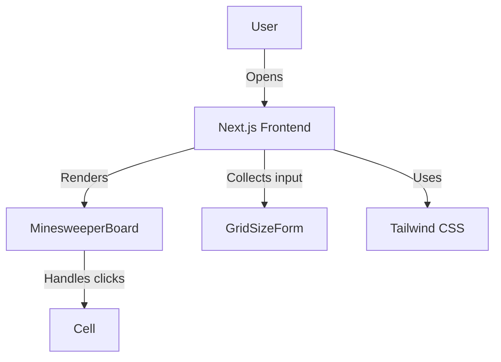

# Minesweepers of the Midwest – EECS 581 Team 29

A web-based take on the classic Minesweeper game, built for EECS 581.  
**Frontend:** Next.js (TypeScript, Tailwind)  
**Backend:** Flask (Python)  
**Features:** Accessible, customizable, first-click safety, responsive UI, REST API.

---

## Features

- **Classic 10×10 Minesweeper grid** (default), with choice of 10–20 mines.
- **First-click safety:** Your first cell (and its neighbors) are always safe.
- **Flag and reveal:** Right-click or long-press to toggle flags, left-click to uncover cells.
- **Flood reveal:** Uncovering an empty cell automatically reveals adjacent safe cells.
- **Responsive UI:** Works great on desktop and mobile.
- **Accessibility:** Keyboard navigation, color-independent status, screen reader labels.
- **REST API:** All gameplay logic handled by backend Flask API.

---

## System Overview

### Architecture

- **Frontend**:
  - Next.js app with React components (`Minesweeper`, `MinesweeperBoard`, `Cell`, `GridSizeForm`)
  - Handles user input, renders grid, calls backend API.
  - Styling via Tailwind CSS.

- **Backend**:
  - Python Flask app (`main.py`) exposes REST endpoints for game actions.
  - Game logic in Python modules (`board.py`, `bombs.py`).
  - Session store tracks game state per user.

### Component Diagram (Excerpt)


---

## How to Run (Local Development)

### Prerequisites
- Node.js & npm (for frontend)
- Python 3.9+ (for backend)
- pip (for Python dependencies)

### 1. Backend Setup (Flask)
```bash
cd backend
pip install -r requirements.txt
python main.py   # or flask run (if structured as Flask app)
```
- This launches the REST API at `http://localhost:5000`
- Endpoints:
  - `POST /new` — Start a new game
  - `POST /uncover` — Reveal a cell
  - `POST /flag` — Toggle flag on a cell
  - `GET /state` — Get current board state

### 2. Frontend Setup (Next.js)
```bash
cd frontend
npm install
npm run dev
```
- Launches web app at `http://localhost:3000`
- Connects to backend API (`http://localhost:5000` by default).

---

## How to Play

1. **Choose the number of mines (10–20) from the buttons at the top.**
2. **Click a cell to uncover it.**
   - First click is always safe (no mine in cell or neighbors).
   - Empty cells trigger flood reveal of safe neighbors.
3. **Right-click (or long-press on mobile) to place or remove a flag.**
4. **Win by uncovering all non-mine cells. Lose by clicking a mine.**
5. **Use the "New Game" button to reset.**

---

## Frontend Components & Functions

- **`Minesweeper`** (`frontend/src/components/Minesweeper.tsx`)
  - Top-level game component.
  - Handles game state, rendering, user input.
  - Calls backend API via helper functions (`createGame`, `getState`, `reveal`, `flag`).
  - Functions:
    - `newGame(mines)`: Starts a new game.
    - `onReveal(r, c)`: Reveals cell at row `r`, col `c`.
    - `onFlag(r, c)`: Toggles flag on cell.
    - `handleCellMouseDown(e, r, c)`: Handles left/right click events.
    - `numberTextColor(val)`: Maps numbers to color classes (for cell display).
    - Renders grid of buttons styled as cells.

- **`MinesweeperBoard`** (`frontend/src/components/MinesweeperBoard.tsx`)
  - Renders static grid for board (presentation only).
  - Used for visualization and animation.
  - Accepts `size` and `mines` props.

- **`Cell`**
  - Individual cell component.
  - Accepts props for revealed/flagged state and click handlers.

- **`GridSizeForm`**
  - UI for selecting board size and mine count.

---

## Backend Modules & Functions

- **`main.py`**
  - Entrypoint for Flask app & CLI.
  - Handles board creation, mine placement, command parsing, game loop (CLI).
  - Functions:
    - `main()`: Starts game loop or server.
    - Uses helpers: `create_board`, `place_mines`, `reveal_cell`, `toggle_flag`, `is_win`, etc.

- **`bombs.py`**
  - Handles mine logic.
  - Functions:
    - `place_mines(board, mines, width, height, forbidden)`: Places mines avoiding forbidden zone (first click).
    - `compute_numbers(board, width, height)`: Sets numbers for adjacent mines.
    - `neighbors(r, c, width, height)`: Yields neighbor coordinates.

- **`board.py`** (assumed from imports)
  - Core board management.
  - Functions:
    - `create_board(width, height)`: Creates empty board.
    - `reveal_cell(board, r, c)`: Reveals cell, triggers flood if empty.
    - `toggle_flag(board, r, c)`: Flags/unflags cell.
    - `is_win(board)`: Checks win condition.
    - `placed_flag_count(board)`: Counts flags.

---

## API Endpoints (Backend)

| Endpoint         | Method | Purpose                    | Payload                   |
|------------------|--------|----------------------------|---------------------------|
| `/new`           | POST   | Start a new game           | `{mines: int, safe: bool}`|
| `/uncover`       | POST   | Reveal a cell              | `{gameId, row, col}`      |
| `/flag`          | POST   | Flag/unflag a cell         | `{gameId, row, col}`      |
| `/state`         | GET    | Get current game state     | `{gameId}`                |

---

## Testing Strategy

- **Logic:** Unit tests for placement, adjacency, flood, win/loss.
- **API:** Integration tests for all REST endpoints and error handling.
- **Frontend:** Smoke tests to verify grid renders, click triggers API call, keyboard nav.
- **Accessibility:** Manual screen reader and color-blind passes.


---

## Credits

Team 29: Ansuman (Team Lead), Achinth (Observer), Vamsi (last day clutch hero), Taha (observer 2), Jahnvi (clutch project manager)  
Course: EECS 581, Fall 2025
